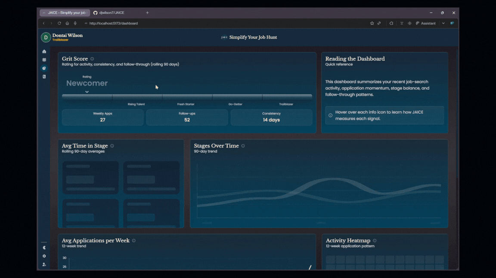
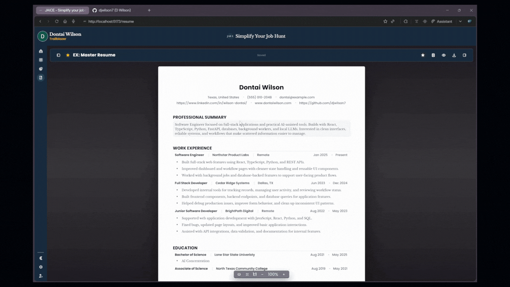

# **JAICE — Job Application Intelligence & Career Enhancement**


JAICE is a full-stack job search workspace that helps users manage applications, recruiter emails, resume versions, and follow-up activity from one organized system.

Modern job searching creates scattered information across inbox threads, spreadsheets, job boards, resume files, and application portals. JAICE brings that activity into a single workflow by combining authenticated account management, Gmail ingestion, rule-based email classification, selective local LLM inference, a Kanban-style application board, dashboard analytics, resume versioning, PDF export, and AI-assisted resume feedback.

The goal is to make the job search feel less like manually digging through disconnected tools and more like managing a focused application pipeline. Users can track opportunities, inspect relevant emails, organize application status, refine resume content, and review job-search activity through one cohesive interface.

JAICE was built as a production-style portfolio project with a React and TypeScript frontend, a FastAPI backend, Redis-backed Celery workers, local Ollama inference, Dockerized services, and modular processing queues for email ingestion, classification, resume generation, and AI-assisted review.

## **Contents**

- [Product Preview](#product-preview)
- [Core Features](#core-features)
- [Technical Architecture](#technical-architecture)
- [Project Summary](#project-summary)
- [Local Development](#local-development)
- [Frontend Test Coverage](#frontend-test-coverage)
- [Backend Test Coverage](#backend-test-coverage)
- [License](#license)
- [Authors & Credits](#authors--credits)

## **Product Preview**

The v1.0.0 walkthrough follows the core JAICE workflow: connect Gmail, process job-search emails, manage applications, inspect analytics, create resume versions, and review local AI feedback.

Each preview highlights one part of the product experience and shows how JAICE turns scattered job-search activity into a structured application pipeline.

***Note***: *Mock data is included in the previews below to demonstrate behavior.*

---

### 1. Gmail Intake & Processing Queue


JAICE starts from a Gmail-connected sync workflow where users can choose how far back to scan for job-search email. Incoming messages are collected, evaluated, classified, and moved into the application workflow without requiring the user to manually copy details from their inbox.

**What to notice:** JAICE treats email intake as a controlled workflow, not a raw inbox import.

#### Highlights

- Gmail-connected sync workflow
- User-selected sync range for recent email intake
- Background email sync and queued processing
- Processing cards that show incoming work before classification completes
- Rule-based classification for high-confidence emails
- Selective local inference for ambiguous job-related messages
- Automatic movement from email intake into the application pipeline

---

### 2. Application Pipeline Board


The Application Pipeline Board is the primary workspace for managing job opportunities. Imported emails become application cards that can be reviewed, expanded, edited, moved between stages, archived, or deleted from a single interactive board.

**What to notice:** The board turns disconnected job-search activity into a manageable pipeline.

#### Highlights

- Expandable application cards with imported email context
- Drag-and-drop movement across application stages
- Multi-select actions for review, archive, and delete flows
- Manual application creation and editing
- Undo and redo support for board interactions
- Optimistic UI updates with realtime refresh behavior

---

### 3. Job Search Analytics



The Dashboard turns application activity into measurable feedback. Instead of only storing applications, JAICE summarizes job-search momentum through charts, status breakdowns, activity patterns, and pacing metrics.

**What to notice:** JAICE helps users understand the health and movement of their job-search pipeline.

#### Highlights

- Grit score summary
- Applications over time
- Applications by stage
- Accepted and rejected application split
- Average time in stage
- Average applications per week
- Activity heatmap
- Realtime refresh from application changes

---

### 4. Structured Resume Builder


The Resume Builder provides a structured editing workspace for creating exportable resumes. Resume data is managed through dedicated sections while still being presented inside a document-like editing surface with layout controls and PDF export support.

**What to notice:** Resume editing is treated as a first-class product surface, not a basic form.

#### Highlights

- Editable resume document surface
- Contact, summary, experience, education, and skills sections
- Page size, margin, typography, and layout controls
- PDF preview and export actions
- Left and right rail layout for focused editing
- Render diagnostics used for PDF drift debugging

---

### 5. Resume Versioning



Resume versioning allows users to maintain a master resume while creating targeted versions for specific roles. Users can clone existing resumes, switch between versions, update metadata, and preserve tailored resume history without overwriting their base resume.

**What to notice:** JAICE supports the real resume workflow: one master resume, many targeted versions.

#### Highlights

- Master resume tracking
- Cloned resume versions
- Source resume relationships
- Target job metadata
- Version switching
- Update and delete flows
- Structured resume persistence

---

### 6. Local AI Resume Feedback


JAICE includes a local AI feedback layer for reviewing, improving, and tailoring resume content. The assistant can stream feedback, suggest section-level rewrites, evaluate resume quality, and help adapt content for a target role while keeping generated changes reviewable before they are applied.

**What to notice:** AI support improves the resume workflow without taking control away from the user.

#### Highlights

- Streaming resume assistant chat
- Section-specific rewrite suggestions
- Reviewable accept and reject flows
- Summary and bullet improvement
- Resume evaluation
- Tailoring against a target job description
- Local Ollama provider by default
- Optional OpenAI provider when explicitly configured


## **Core Features**


### Job Search Workflow

JAICE organizes the job search around a structured application pipeline instead of scattered inbox threads, spreadsheets, and resume files.

- Gmail OAuth connection for importing job-search email activity
- Background email intake through Redis-backed Celery workers
- Rule-based classification for high-confidence job-related messages
- Selective local inference for ambiguous emails
- Kanban-style application board for managing opportunities by stage
- Expandable cards with imported email context and application details
- Manual application creation for opportunities that do not originate from Gmail

---

### Application Management

The Home board is the primary workspace for reviewing, updating, and organizing applications.

- Processing, applied, interview, offer, accepted, rejected, review, archive, and trash workflows
- Drag-and-drop movement across pipeline stages
- Multi-select actions for review, archive, and delete flows
- Manual application editing
- Undo and redo support for selected board actions
- Optimistic UI updates
- Realtime refresh behavior across application surfaces

---

### Gmail Intake & Classification

JAICE connects to Gmail, imports candidate messages, and processes them through a background worker pipeline.

- Google OAuth consent flow
- Gmail API integration
- Google Cloud Pub/Sub listener for mailbox updates
- Redis-backed Celery queues for background processing
- Gmail intake and content fetch workers
- Rule-based relevance and classification filtering
- Local inference queue for lower-confidence or ambiguous job-related messages
- Application card creation after classification

---

### Dashboard Analytics

The dashboard turns application activity into measurable job-search feedback.

- Grit score summary
- Applications over time
- Applications by stage
- Accepted and rejected application split
- Average time in stage
- Average applications per week
- Activity heatmap
- Realtime refresh when job data changes


---

### Resume Builder

The resume module provides a structured editing workspace for creating and exporting resumes.

- Structured resume data model
- Editable contact, summary, experience, education, and skills sections
- Document-style editing surface
- Page size, margin, typography, and layout controls
- PDF preview and export support
- Render diagnostics for debugging canvas and PDF drift

---

### Resume Versioning

JAICE supports master resumes and targeted resume versions for different roles.

- Master resume tracking
- Cloned resume versions
- Source resume relationships
- Target job metadata
- Version switching
- Clone, update, and delete flows
- Structured resume persistence

---

### Local AI Resume Feedback

JAICE uses a local-first model layer for resume assistance. Ollama is the default provider, while OpenAI can be enabled only when explicitly configured.

- Streaming resume assistant chat
- Section-level rewrite suggestions
- Reviewable accept and reject rewrite flows
- Summary improvement
- Bullet improvement
- Resume evaluation
- Resume tailoring against a target job description
- Job listing analysis

---

### Accessibility & Personalization

JAICE includes application-level display preferences that make dense job-search workflows easier to read, scan, and control.

- Font size controls for cards, forms, and document-oriented views
- Light and dark theme support
- Contrast level controls for stronger visual separation and improved legibility
- Animation speed controls for reducing or increasing motion intensity
- Settings-backed preferences applied across the application interface


## **Technical Architecture**

JAICE is a multi-service full-stack application built around a React frontend, a FastAPI backend, Redis-backed Celery workers, Supabase/Postgres persistence, Gmail ingestion, and local model inference.

The system is organized around a few major responsibilities:

- The frontend provides the authenticated product interface, application board, dashboard, resume editor, settings, and AI feedback surfaces.
- The FastAPI backend exposes application, resume, authentication, Gmail, and model-facing API routes.
- Redis and Celery coordinate background work for Gmail intake, message fetching, classification, local inference, and entity extraction.
- Supabase/Postgres stores application records, resume data, user-linked entities, and workflow state.
- Gmail and Google Cloud Pub/Sub provide mailbox access and update notifications.
- Ollama provides the default local model runtime for resume feedback and selective email inference.

### Stack Overview

| Layer | Technology |
| --- | --- |
| Frontend | React 19, TypeScript, Vite, Tailwind CSS, Framer Motion |
| Routing | React Router |
| Auth | Firebase Auth, Firebase Admin |
| API | FastAPI |
| Database | Supabase/Postgres |
| Realtime | Supabase Realtime |
| Queueing | Redis, Celery |
| Gmail | Google OAuth, Gmail API, Google Cloud Pub/Sub |
| Workers | Gmail intake, content fetch, classification, inference |
| Local AI | Ollama |
| Resume AI | Local Ollama by default, optional OpenAI provider |
| Analytics | Chart.js |
| Frontend Testing | Vitest, React Testing Library, V8 coverage |
| Backend Testing | pytest, pytest-cov, coverage.py |
| Dev Environment | Docker Compose, Vite, Python virtual environment |

### Service Layout

Docker Compose starts the backend, queue, worker, monitoring, and local model services.

```text
redis
client_api
gmail_request_intake
gmail_fetch_content
gmail_pubsub_listener
classification_worker
email_inference_worker
flower
local_llm
local_llm_model_loader
```

The frontend runs outside Docker through Vite so the UI can use the normal local development flow while the backend and worker stack run in containers.

### Processing Flow

```text
Gmail / Pub/Sub
    ↓
Gmail intake worker
    ↓
Content fetch worker
    ↓
Rule-based relevance and classification
    ↓
High-confidence result ─────────────→ Application card workflow
    ↓
Ambiguous result
    ↓
Local inference queue
    ↓
Final classification
    ↓
Application board, review queue, archive, or ignored state
```

This structure keeps fast rule-based processing separate from slower local model inference. Most messages can be classified without model calls, while ambiguous emails can still be evaluated by the local inference worker.

### Resume AI Flow

```text
Resume editor
    ↓
Resume API
    ↓
Resume chat service
    ↓
Configured model provider
    ├── Ollama by default
    └── OpenAI only when explicitly configured
    ↓
Streaming feedback and reviewable rewrite suggestions
```

The resume assistant is designed to support the editing workflow without directly overwriting user content. Suggestions are streamed, reviewed, and applied through explicit user actions.


## **Project Summary**

JAICE is a full-stack job application command center for managing the job-search workflow from one place.

It imports job-search email, classifies relevant messages, turns them into trackable application cards, provides dashboard analytics, and includes a structured resume builder with versioning, PDF export, and local AI feedback.

The project demonstrates:

- Full-stack product architecture
- Authenticated user flows
- Gmail API and Google OAuth integration
- Background worker pipelines with Redis and Celery
- Rule-based email classification with selective local inference
- Realtime application updates
- Kanban-style job application management
- Resume document rendering and PDF export
- Local Ollama-backed AI workflows
- Dashboard analytics and job-search activity tracking
- Accessibility and personalization settings
- Practical job-search workflow design

## **Local Development**

JAICE is not a plug-and-play static app. It requires external service configuration for authentication, database access, Gmail ingestion, Pub/Sub updates, background workers, and local model inference.

Running the full system locally is possible, but it assumes the developer has configured the required cloud services and has enough local hardware to run the selected Ollama model.

### Requirements

- Node.js and npm
- Python environment compatible with the backend services
- Docker and Docker Compose
- Firebase project
- Supabase project
- Google OAuth client
- Gmail API access
- Google Cloud Pub/Sub topic and subscription
- Redis, provided through Docker Compose
- Ollama-compatible local model runtime, provided through Docker Compose
- Sufficient local memory/CPU/GPU resources for the selected model

### 1. Clone the project

```bash
git clone https://github.com/SephenSmothers/JAICE_Project.git jaice
cd jaice
npm install
```

### 2. Configure environment variables

Create a root `.env` file with the required frontend, backend, database, Firebase, Google OAuth, Gmail Pub/Sub, Redis, and model configuration values.

Do not commit this file.

At minimum, local development requires configuration for:

```text
Firebase client and admin credentials
Supabase URL and keys
Google OAuth client credentials
Gmail API access
Google Cloud Pub/Sub credentials
Redis broker configuration
Ollama base URL and model settings
Resume AI provider settings
Email inference provider settings
```

### 3. Start backend and worker services

```bash
docker compose up --build
```

This starts the API, Redis, Celery workers, Flower monitoring, Ollama, and the local model loader.

### 4. Start the frontend

In a separate terminal:

```bash
npm run dev
```

The frontend runs at:

```text
http://localhost:5173/
```

### 5. Validate the frontend build

```bash
npm run lint
npm run build
npm run preview
```

### 6. Run backend tests

```bash
.\.venv\Scripts\python.exe scripts\run_backend_tests.py
```

### Local Model Notes

JAICE uses Ollama as the default local model provider for resume feedback and selective email inference.

The Docker Compose stack includes:

```text
local_llm
local_llm_model_loader
```

The model loader pulls the configured model, such as:

```text
qwen2.5:1.5b
```

Local inference performance depends on the machine running the stack. Smaller models are recommended for development because resume feedback and email inference can become slow on limited hardware.

### Development Notes

- Python source changes in mounted backend and worker directories are hot-reloaded by Uvicorn or `watchmedo`.
- Environment variable changes usually require recreating the affected service.
- Dockerfile or dependency changes require rebuilding the affected service.
- Gmail ingestion requires valid Google OAuth and Pub/Sub configuration before the full email pipeline will work.
- Resume AI can run locally through Ollama without requiring OpenAI configuration.
- OpenAI is optional and only used when explicitly configured.


## **Frontend Test Coverage**

The frontend test suite currently includes **189 passing test files** and **876 passing tests**.

Coverage is generated with **Vitest** using the **V8 coverage provider**.

| Metric | Coverage | Covered / Total |
| :--- | ---: | ---: |
| Statements | **93.01%** | 4686 / 5038 |
| Branches | **82.96%** | 3462 / 4173 |
| Functions | **93.70%** | 1265 / 1350 |
| Lines | **94.68%** | 4398 / 4645 |

### Coverage Highlights

- Broad frontend coverage across application layout, navigation, global components, services, dashboard views, resume tooling, home workflow, and settings pages.
- Several core areas are at or near full coverage, including app initialization, layout components, settings display, settings providers, home contexts, home providers, and shared UI components.
- Statements, functions, and lines are all above **93%**.
- Branch coverage is above **82%**, with remaining gaps concentrated in conditional-heavy UI flows such as resume editing, dashboard cards, home hooks, modals, and account settings.

### Detailed Results

The full frontend coverage output is stored in:

```text
docs/test-results/FRONTEND_TEST_RESULTS.md
```

That file includes the complete per-file coverage table, uncovered line references, total test count, and run duration.

### Test Command

```bash
npm run test:coverage
```

### Local HTML Report

After running coverage, open the generated HTML report:

```bash
start coverage/index.html
```

The HTML report is a generated static artifact. Re-run the coverage command after changing tests, then refresh the browser tab to view updated results.

## **Backend Test Coverage**

The backend test suite currently includes **487 passing tests**.

Coverage is generated with **pytest** across the Python service layers, including the client API, Gmail workers, classification pipeline, shared worker utilities, database helpers, security utilities, and resume chat services.

| Metric | Coverage | Covered / Total |
| :--- | ---: | ---: |
| Statements | **97.53%** | 4818 / 4940 |
| Branches | **96.72%** | 1240 / 1282 |
| Functions | **97.95%** | 335 / 342 |
| Lines | **97.53%** | 4818 / 4940 |

### Coverage Highlights

- Strong backend coverage across the client API, classification system, Gmail ingestion pipeline, shared worker library, database query helpers, and resume chat service.
- Most backend modules are at or near **100% coverage** across statements, branches, functions, and lines.
- Statements, branches, functions, and lines are all above **96%**.
- Remaining gaps are concentrated in a small number of operationally dense modules, including Gmail task handling, Pub/Sub listener behavior, auth API edge cases, and select classification task branches.

### Detailed Results

The full backend coverage output is stored in:

```text
docs/test-results/BACKEND_TEST_RESULTS.md
```

That file includes the complete per-file coverage table, uncovered line references, and backend coverage summary.

### Test Command

Run the backend test suite with coverage using the project virtual environment:

```powershell
.\.venv\Scripts\python.exe scripts\run_backend_tests.py
```

On Unix-like shells, use the equivalent virtual environment Python path:

```bash
./.venv/bin/python scripts/run_backend_tests.py
```

## **License**

This project is licensed under the terms included in the repository `LICENSE` file.

## **Authors & Credits**

JAICE began as a team project with contributions from:

| Name | Role | Until |
| --- | --- | --- |
| Antonio Lee Jr. | Developer | Alpha Release
| Maya Henderson | Developer | Alpha Release
| Dontai Wilson | Developer | v1.0.0
| Sephen Smothers | Developer | Alpha Release

After the initial team version, the project was roadmapped, redesigned, and heavily refined through a solo v1.0.0 refactor by **Dontai Wilson**.

This later refactor focused on turning the original project foundation into a more cohesive full-stack product demo. The work included unifying the application flow, modernizing major UI surfaces, refining the job application board, expanding the resume workflow, improving Gmail processing behavior, integrating local AI-assisted resume feedback, adding accessibility and personalization settings, and preparing the project for a stronger public portfolio presentation.

The current version preserves credit for the original team contribution while documenting the later individual work required to bring JAICE to its v1.0.0 readiness marker.